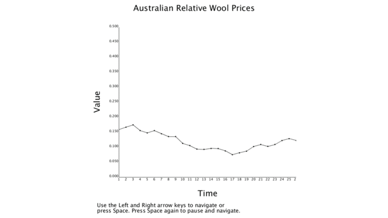

## Description
This program display an interactive line graph with values loaded in from a CSV table.

## Requirements
- Processing

## How to Use
Open the file named "interactive_line_graph.pde." Click play. The user is able to either navigate through the graph by using the left and right arrow keys or press space and have the graph move on its own. The user can pause the movement by pressing space again and navigate left and right from where it paused.